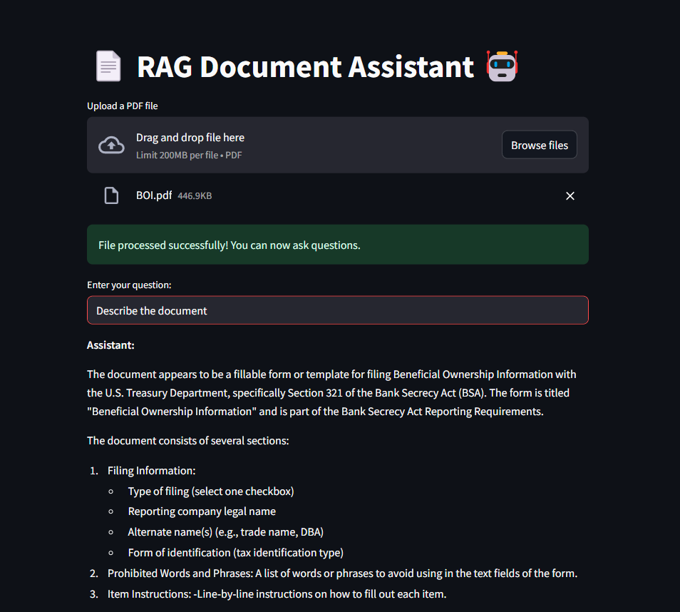

# 📚 RAG Document Chat 

A Streamlit-based AI-powered document assistant that allows users to upload a PDF file and ask questions based on its content. It leverages LangChain, Ollama's Llama3.2 model, and ChromaDB for semantic search and retrieval-augmented generation (RAG).

   &nbsp &nbsp

## ✨ Features  

- Upload & Process PDFs – Users can upload a PDF file for AI-based querying. 
- Chunk-Based Retrieval – The document is split into smaller chunks for efficient searching.
- Vector Database – Uses ChromaDB to store embeddings for fast and accurate retrieval.  
- Multi-Query Retriever – Enhances the search process by generating multiple variations of the question.
- LLM-Powered Answers – Uses Llama3.2 via Ollama to generate intelligent responses.
- User-Friendly UI – Built with Streamlit for an intuitive experience.

## ✨ Note  
- You need to have ollama setup on your system
